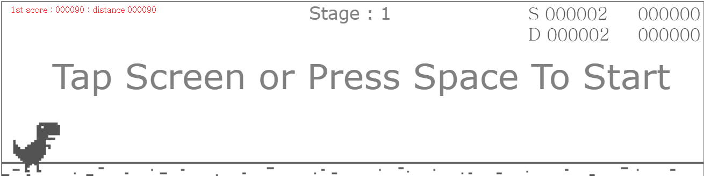

# 웹소켓 게임 만들기



## 프로젝트 구조

```bash
/websocket-dino
├── assets/               # 게임 관련 자산 (이미지, 사운드 등)
├── node_modules/         # 프로젝트에 설치된 npm 패키지들
├── public/               # 다이노 클라이언트
├── redis/                # Redis 관련 설정 및 데이터 관리
├── src/                  # 주요 소스 코드 폴더
│   ├── handlers/         # 이벤트 핸들러, WebSocket 이벤트 처리 로직
│   ├── init/             # 초기화 관련 설정 및 코드 (초기 데이터, 서버 설정 등)
│   ├── models/           # 데이터 모델 정의 (예: 데이터베이스 또는 Redis와 연동하는 모델)
│   ├── redis/            # Redis와의 연결 및 작업을 위한 파일
│   ├── app.js            # 서버 초기화 및 WebSocket 서버 로직
│   └── constants.js      # 전역적으로 사용하는 상수 정의
├── .dockerignore         # Docker 빌드 시 무시할 파일 목록
├── .gitignore            # Git에서 무시할 파일 목록
├── .prettierrc           # Prettier 코드 스타일 설정 파일
├── docker-compose.yml    # Docker 컨테이너 설정 파일 (Redis 등 관련 설정 포함)
├── Dockerfile            # Docker 이미지 생성 설정 파일
├── LICENSE               # 라이센스 정보
├── nodemon.json          # Nodemon 설정 파일 (개발 중 자동 재시작 설정)
├── package-lock.json     # 프로젝트 종속성 버전 고정 파일
├── package.json          # 프로젝트 설정 및 의존성 정보
└── readme.md             # 프로젝트 설명 파일 (README)

```

## 점수 검증 방법

획득한 아이템을 기준으로 하지 않고 해당 스테이지에서 획득할 수 있는 최대 점수를 기준으로 검증합니다.

1. 초당 획득하는 점수는 1.0
2. 해당 스테이지에서 제일 높은 아이템의 점수는 maxItemScore
3. 제일 많이 나타날 수 있는 빈도는 초당 1개
4. 해당 스테이지의 진행시간은 elapsed

따라서 elapsed + elapsed * maxItemScore가 최대 획득 가능 점수지만, 게임 속도 만큼의 여유분을 추가했습니다.
이렇게 해서 획득한 아이템을 굳이 하나하나 검증할 필요 없이 가능한 점수인지만 검증하는 식으로 작업했습니다.


## 레디스 사용 방법
레디스는 docker-compose를 통해 외부에 노출하지 않고 직접  해당 서버에서 사용하도록 작업했습니다.


